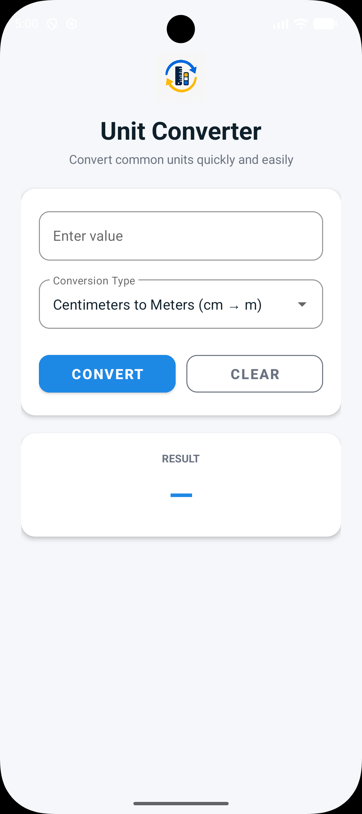
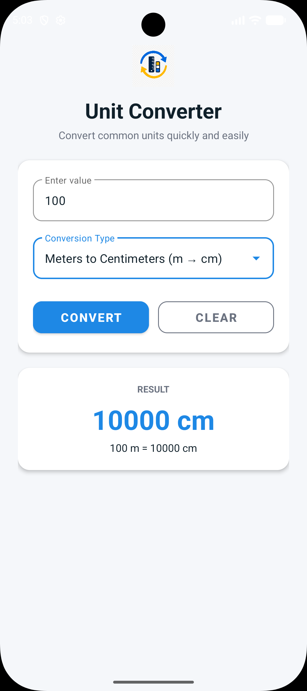

# OIBSIP Android Task 1 - Unit Converter App

## Overview

A clean and modern native Android Unit Converter application built as part of the **Oasis Infobyte Android Application Development Internship**.

The app allows users to quickly convert common units of length, mass, and temperature. It provides a simple input field, conversion type selector, convert button, clear button, and a clean result display.

---

## Internship Information

* **Company:** Oasis Infobyte
* **Internship Domain:** Android Application Development
* **Task:** Task 1 - Unit Converter Application
* **Author:** Abdinasir Osman Warsame

---

## Features

* **Clean Material Design:** Built using a modern color palette with rounded cards, custom elevations, and smooth spacing.
* **Multiple Unit Conversions:** Supports length, mass, and temperature conversions.
* **Input Validation:** Checks for empty inputs and invalid non-numeric values.
* **Formatted Results:** Displays results clearly and removes unnecessary decimal zeros.
* **Clear Button:** Resets the input field, selected conversion result, and error messages.
* **Keyboard Handling:** Hides the keyboard after conversion for a cleaner user experience.
* **Custom App Icon:** Uses a custom launcher icon for the application.

---

## Supported Conversion Types

The application supports the following 8 conversion types:

### Length

* Centimeters to Meters (cm → m)
* Meters to Centimeters (m → cm)
* Kilometers to Meters (km → m)
* Meters to Kilometers (m → km)

### Mass

* Grams to Kilograms (g → kg)
* Kilograms to Grams (kg → g)

### Temperature

* Celsius to Fahrenheit (°C → °F)
* Fahrenheit to Celsius (°F → °C)

---

## Technologies Used

* **Language:** Java
* **UI:** Android XML Layouts
* **Design Components:** Android Material Components
* **Build System:** Gradle
* **IDE:** Android Studio

---

## Project Structure

```text
OIBSIP_Android_Task1_UnitConverter/
│
├── app/
│   ├── src/
│   │   └── main/
│   │       ├── java/com/abdinasir/unitconverter/
│   │       │   ├── MainActivity.java
│   │       │   ├── UnitConverter.java
│   │       │   └── ConversionType.java
│   │       │
│   │       ├── res/
│   │       │   ├── layout/
│   │       │   │   └── activity_main.xml
│   │       │   │
│   │       │   ├── mipmap-mdpi/
│   │       │   │   └── ic_launcher.png
│   │       │   ├── mipmap-hdpi/
│   │       │   │   └── ic_launcher.png
│   │       │   ├── mipmap-xhdpi/
│   │       │   │   └── ic_launcher.png
│   │       │   ├── mipmap-xxhdpi/
│   │       │   │   └── ic_launcher.png
│   │       │   ├── mipmap-xxxhdpi/
│   │       │   │   └── ic_launcher.png
│   │       │   │
│   │       │   └── values/
│   │       │       ├── colors.xml
│   │       │       ├── strings.xml
│   │       │       └── themes.xml
│   │       │
│   │       └── AndroidManifest.xml
│   │
│   └── build.gradle.kts
│
├── docs/
│   └── images/
│       ├── screenshot_home.png
│       └── screenshot_result.png
│
├── gradle/
├── build.gradle.kts
├── settings.gradle.kts
├── gradle.properties
├── gradlew
├── gradlew.bat
├── .gitignore
└── README.md
```

---

## App Screenshots

### Home Screen



### Conversion Result



---

## How to Run

### Prerequisites

Make sure you have the following installed:

* Android Studio
* Android SDK
* Java Development Kit
* Android Emulator or a physical Android device

### Run with Android Studio

1. Clone or download this repository.
2. Open Android Studio.
3. Select **Open** and choose the project folder:

```text
OIBSIP_Android_Task1_UnitConverter
```

4. Wait for Gradle sync to complete.
5. Start an emulator or connect an Android phone using USB debugging.
6. Click the **Run** button.

### Build from Command Line

From the project root, run:

```powershell
.\gradlew.bat assembleDebug
```

The debug APK will be generated at:

```text
app/build/outputs/apk/debug/app-debug.apk
```

---

## Sample Conversion Results

| Input | Conversion Type       | Output |
| ----- | --------------------- | ------ |
| 100   | Centimeters to Meters | 1 m    |
| 1     | Meters to Centimeters | 100 cm |
| 1000  | Grams to Kilograms    | 1 kg   |
| 1     | Kilograms to Grams    | 1000 g |
| 1     | Kilometers to Meters  | 1000 m |
| 1000  | Meters to Kilometers  | 1 km   |
| 0     | Celsius to Fahrenheit | 32 °F  |
| 32    | Fahrenheit to Celsius | 0 °C   |

---

## Validation

The app handles common input issues:

* If the input field is empty, the app displays:

```text
Please enter a value.
```

* If the input is not a valid number, the app displays:

```text
Please enter a valid number.
```

---

## Author

**Abdinasir Osman Warsame**  
Android Application Development Intern  
Oasis Infobyte

---

## Acknowledgement

This project was completed as part of the **Oasis Infobyte Android Application Development Internship**.
